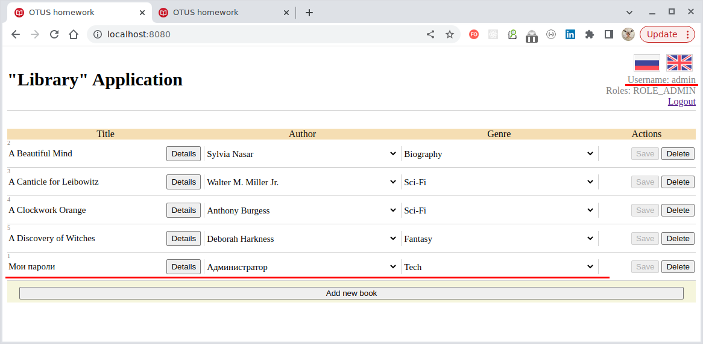

## Приложение "Библиотека" со Spring Security ACL

### 1. Запуск

<details>
  <summary>Вариант 1 (предпочтительный): Docker-Compose.</summary>

Приложение докеризировано и запустить его можно с помощью [docker-compose](docker-compose.yaml):

````yaml
$ docker-compose up -d
  [ + ] Running 5/5
  ✔ webapp-pg 4 layers [⣿⣿⣿⣿]      0B/0B      Pulled    10.1s
  ✔ 38a980f2cc8a Already exists                           0.0s
  ✔ de849f1cfbe6 Already exists                           0.0s
  ✔ a7203ca35e75 Already exists                           0.0s
  ✔ 630b03514285 Pull complete                            7.2s
  [ + ] Running 5/5
  ✔ Network spring-09-jdbc_default  Created               0.1s
  ✔ Container docker-hoster         Started               0.6s
  ✔ Container postgres              Healthy              31.5s
  ✔ Container webapp-pg             Started              31.6s
  ✔ Container pgadmin               Started
````

</details>

<details>
  <summary>Вариант 2: "java -jar".</summary>

Артефакт `webapp-pg.jap` является исполняемыми, его следует собрать из корня проекта:

````shell
$ ./mvnw clean install -DskipTests

[INFO] Scanning for projects...
[INFO] 
[INFO] -------------------< ru.otus.spring:spring-09-jdbc >--------------------
[INFO] Building spring 0.0.1-SNAPSHOT
[INFO] --------------------------------[ jar ]---------------------------------
[INFO] 
...
[INFO] ------------------------------------------------------------------------
[INFO] BUILD SUCCESS
[INFO] ------------------------------------------------------------------------
[INFO] Total time:  7.018 s
[INFO] Finished at: 2023-05-16T21:11:35+07:00
[INFO] ------------------------------------------------------------------------
````

После сборки артефакт можно запустить:

````shell
$ cd target

$ java -jar webapp-pg.jar

  .   ____          _            __ _ _
 /\\ / ___'_ __ _ _(_)_ __  __ _ \ \ \ \
( ( )\___ | '_ | '_| | '_ \/ _` | \ \ \ \
 \\/  ___)| |_)| | | | | || (_| |  ) ) ) )
  '  |____| .__|_| |_|_| |_\__, | / / / /
 =========|_|==============|___/=/_/_/_/
 :: Spring Boot ::                (v3.0.6)

...
````

</details>

<details>
  <summary>Вариант 3: Конфигурация Intellij IDEA.</summary>

Запуcтить main-класс [Application.java](src/main/java/ru/otus/spring/Application.java)
</details>

### 2. Разграничение доступа к объектам БД с помощью Spring Security ACL

Введены следующие роли и принципалы:

- ROLE_ADMIN ("admin/admin"): может выполнять любые операции **включая доступ к Book id#1 "Мои пароли"**;
- ROLE_COMMENTER ("commenter/commenter"): может выполнять все операции чтения, а также добавлять (но не удалять)
  комментарии. **Доступ к Book id#1 отсутствует**;
- ROLE_READER ("reader/reader"): может выполнять только операции чтения. **Доступ к Book id#1 отсутствует**.

| User/Password       | Role/Authority | ALL | COMMENT | READ | ACL |
|:--------------------|:---------------|:---:|:-------:|:----:|:---:|
| admin/admin         | ROLE_ADMIN     |  +  |    +    |  +   |  +  |
| commenter/commenter | ROLE_COMMENTER |     |    +    |  +   |     |
| reader/reader       | ROLE_READER    |     |         |  +   |     |

Незарегистрированный пользователь имеет доступ только к странице логина.

### 3. Доступ к приложению

Запущенное веб-приложение доступно на порту `8080` ([application.yaml](src/main/resources/application.yaml)).


Пользователю "admin" доступна книга "Мои пароли" (Book id#1):



Пользователям "commenter" и "reader" книга "Мои пароли" (**Book id#1**) недоступна:


---
