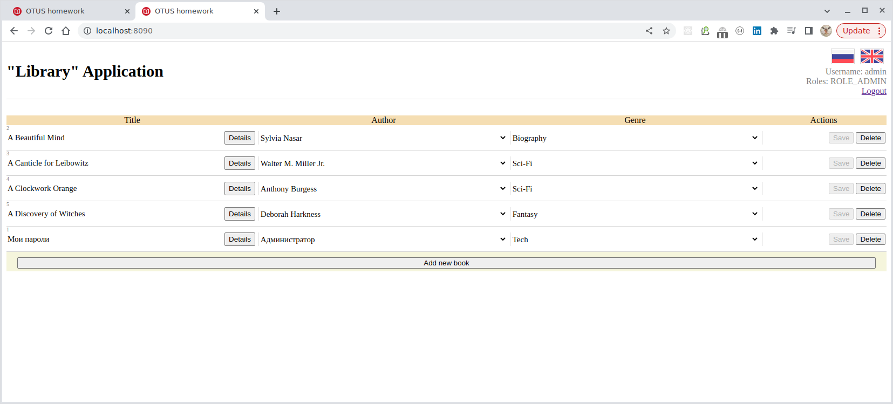
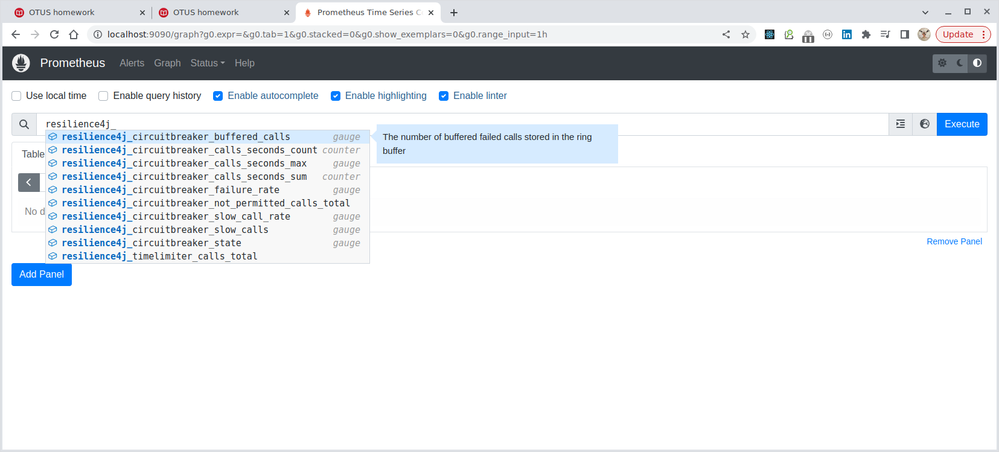
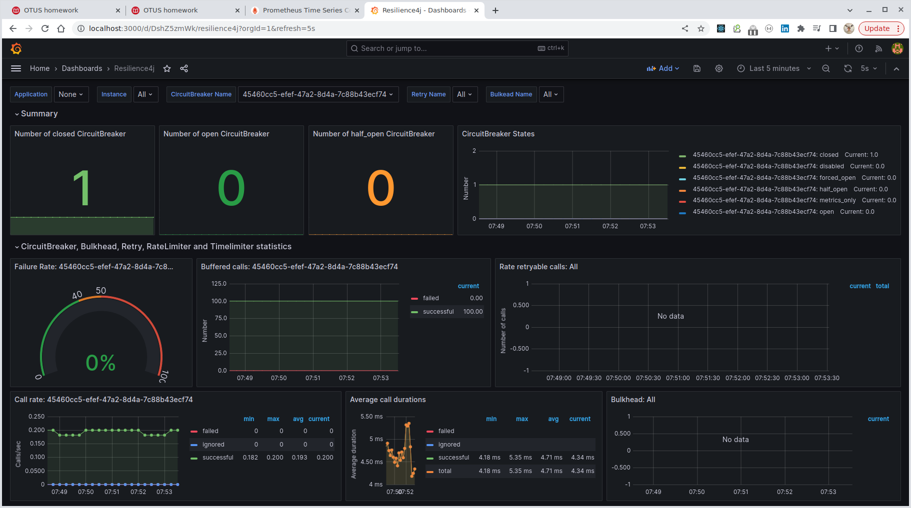

## Resilience4j: Шлюз, обеспечивающий эластичность приложения "Библиотека".

### Порядок работы

1. Запустить все необходимые контейнеры веб-приложения через [Docker Compose](../webapp/docker-compose.yaml)
   из модуля ["Webapp"](../webapp):

````bash
$ docker-compose up -d
[+] Running 6/6
 ✔ Network webapp_default   Created     0.1s 
 ✔ Container docker-hoster  Started     0.9s 
 ✔ Container postgres       Healthy    31.9s 
 ✔ Container mongodb        Started     1.4s 
 ✔ Container pgadmin        Started    32.3s 
 ✔ Container webapp-pg      Started    32.1s 
````

Работающее приложение будет доступно по порту `8080`:


2. Запустим контейнеризированное приложение, использующее Spring Cloud Gateway для **проксирования всех запросов
к веб-приложению**, а также контейнеры Prometheus и Grafana, через [Docker Compose](../resilience4j/docker-compose.yml)
из модуля ["Resilience4j"](../resilience4j):

````bash
$ docker-compose up -d
[+] Running 3/3
 ✔ Container webapp-gateway           Healthy    5.8s 
 ✔ Container grafana-resilience4j     Started    0.3s 
 ✔ Container prometheus-resilience4j  Started    6.1s 
````

Работающее приложение Spring Cloud Gateway, проксирующее все вызовы к веб-приложению, будет доступно по порту `8090`:



Prometheus доступен по порту `9090`:



Grafana доступна по порту `3000`:


3. Настроим Grafana. Для этого:

   3.1. укажем **источник данных** метрик `Prometheus`:
      - в главном меню выбираем `Administration` -> `Data sources` -> `Add data source Prometheus`;
      - в поле `Prometheus server URL` укажем URL нашего `Prometheus`, а именно `http://localhost:9090`;
      - если все указано правильно, то после нажатия кнопки `Save & test` появится сообщение `Successfully queried the Prometheus API`.

   3.2. импортируем заранее созданную **панель приборов**:
      - в главном меню выбираем `Dashboards` -> `New` -> `New Dashboard` -> `Меню '+'` -> `Import dashboard` -> `Upload dashboard JSON file`
      - выбираем файл [dashboard.json](../docker/dashboard.json), в поле `Select a Prometheus data source` выбираем источник данных `Prometheus` и нажимаем кнопку `Import`, после чего панель будет создана:
      - 

Как видим, метрики поступают, а Circuit Breaker находится в состоянии `CLOSED`, т.е. всё в порядке, срабатывания нет.

4. Проверим работу `Resilience4j`. Для этого выключим проксируемое веб-приложение командой `docker-compose stop webapp-pg`:

````bash
$ docker-compose stop webapp-pg              
[+] Running 1/1
 ✔ Container webapp-pg  Stopped  
````

Приложение недоступно, шлюз выдаёт fallback-сообщение `Sorry, we're out of order!`:


Процент отказов растет (когда он достигнет 50% `Circuit Breaker` перейдет в состояние `OPEN`):


Процент отказов достиг заданных 50% и `Circuit Breaker` перешел в состояние `OPEN`:


Период времени, установленный для повторной проверки состояния сервиса истек и `Circuit Breaker` переходит
в состояние `HALF_OPEN` (что означает попытку вернуться в состояние `CLOSED`):


Вернем веб-сервис в работоспособное состояние командой `docker-compose up webapp-pg -d`:

````bash
$ docker-compose up webapp-pg -d
[+] Running 3/3
 ✔ Container docker-hoster  Running    0.0s 
 ✔ Container postgres       Healthy    0.5s 
 ✔ Container webapp-pg      Started    0.7s
````

Через некоторое время `Circuit Breaker` возвращается в состояние `CLOSED` и проксируемый сервис снова доступен:


