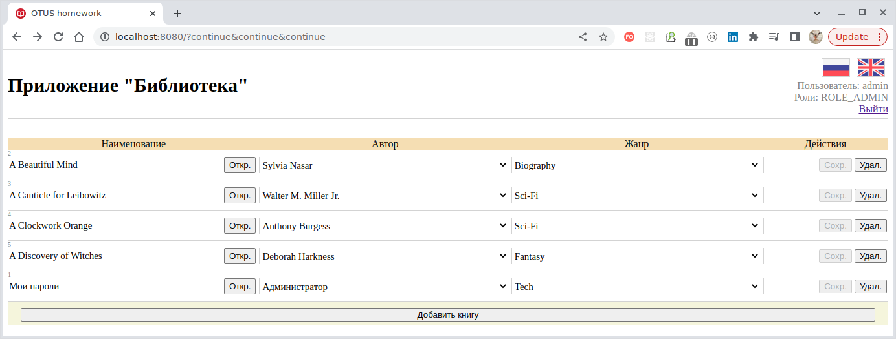
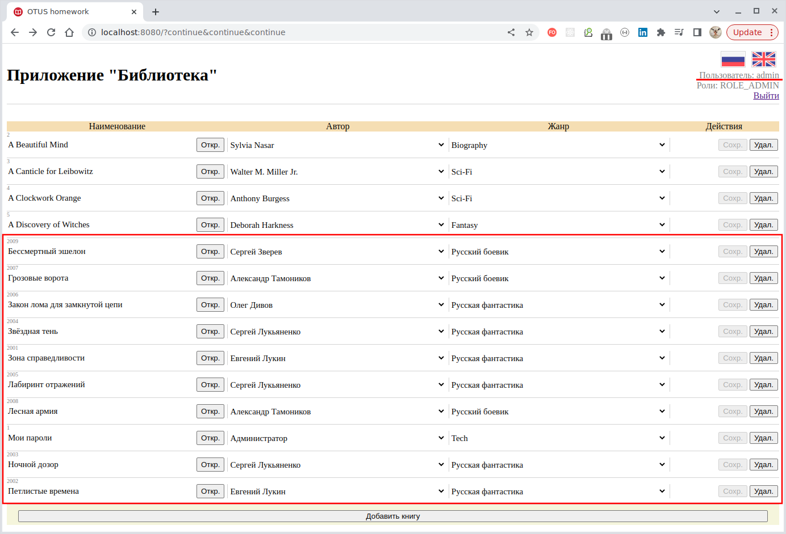

## Spring Batch: Процедуры импорта данных приложения "Библиотека" из БД Mongo в БД Postgres.

### Порядок работы

1. Запустить базы данных Mongo и Postgres (можно воспользоваться [Docker Compose](../webapp/docker-compose.yaml)
   из модуля ["Webapp"](../webapp) и запустить все необходимые контейнеры сразу).

Работающее приложение будет доступно по порту `8080`:



2. Запустить приложение модуля [Spring Batch](../spring-batch);

3. В командной строке Spring Shell выполнить команду `import`, что инициирует процедуру импорта из БД `Mongo` содержимого коллекций:
    - жанры (`genres`);
    - авторы (`authors`);
    - книги(`books`);
    - комментарии к книгам (`book_comments`).

````bash
shell:>import
2023-05-30T22:40:02.142+07:00  INFO 710028 --- [  restartedMain] o.s.b.c.l.support.SimpleJobOperator      : Checking status of job with name=importJob
2023-05-30T22:40:02.180+07:00  INFO 710028 --- [  restartedMain] o.s.b.c.l.support.SimpleJobOperator      : Attempting to launch job with name=importJob and parameters={{date=Tue May 30 22:40:02 NOVT 2023}}
2023-05-30T22:40:02.205+07:00  INFO 710028 --- [  restartedMain] o.s.b.c.l.support.SimpleJobLauncher      : Job: [FlowJob: [name=importJob]] launched with the following parameters: [{'date':'{value=Tue May 30 22:40:02 NOVT 2023, type=class java.lang.String, identifying=true}'}]
2023-05-30T22:40:02.237+07:00  INFO 710028 --- [  spring_batch1] o.s.batch.core.job.SimpleStepHandler     : Executing step: [importAuthorsStep]
2023-05-30T22:40:02.239+07:00  INFO 710028 --- [  spring_batch2] o.s.batch.core.job.SimpleStepHandler     : Executing step: [importGenresStep]
2023-05-30T22:40:02.350+07:00  INFO 710028 --- [  spring_batch2] o.s.batch.core.step.AbstractStep         : Step: [importGenresStep] executed in 109ms
2023-05-30T22:40:02.356+07:00  INFO 710028 --- [  spring_batch1] o.s.batch.core.step.AbstractStep         : Step: [importAuthorsStep] executed in 118ms
2023-05-30T22:40:02.383+07:00  INFO 710028 --- [  restartedMain] o.s.batch.core.job.SimpleStepHandler     : Executing step: [importBooksStep]
2023-05-30T22:40:02.422+07:00  INFO 710028 --- [  restartedMain] o.s.batch.core.step.AbstractStep         : Step: [importBooksStep] executed in 38ms
2023-05-30T22:40:02.436+07:00  INFO 710028 --- [  restartedMain] o.s.batch.core.job.SimpleStepHandler     : Executing step: [importBooksAclObjectStep]
2023-05-30T22:40:02.466+07:00  INFO 710028 --- [  restartedMain] o.s.batch.core.step.AbstractStep         : Step: [importBooksAclObjectStep] executed in 29ms
2023-05-30T22:40:02.479+07:00  INFO 710028 --- [  restartedMain] o.s.batch.core.job.SimpleStepHandler     : Executing step: [importBooksAclEntryStep]
2023-05-30T22:40:02.503+07:00  INFO 710028 --- [  restartedMain] o.s.batch.core.step.AbstractStep         : Step: [importBooksAclEntryStep] executed in 23ms
2023-05-30T22:40:02.515+07:00  INFO 710028 --- [  restartedMain] o.s.batch.core.job.SimpleStepHandler     : Executing step: [importCommentsStep]
2023-05-30T22:40:02.551+07:00  INFO 710028 --- [  restartedMain] o.s.batch.core.step.AbstractStep         : Step: [importCommentsStep] executed in 35ms
2023-05-30T22:40:02.563+07:00  INFO 710028 --- [  restartedMain] o.s.b.c.l.support.SimpleJobLauncher      : Job: [FlowJob: [name=importJob]] completed with the following parameters: [{'date':'{value=Tue May 30 22:40:02 NOVT 2023, type=class java.lang.String, identifying=true}'}] and the following status: [COMPLETED] in 342ms
JobExecution: id=12, version=2, startTime=2023-05-30T22:40:02.215875, endTime=2023-05-30T22:40:02.558415, lastUpdated=2023-05-30T22:40:02.559399, status=COMPLETED, exitStatus=exitCode=COMPLETED;exitDescription=, job=[JobInstance: id=12, version=0, Job=[importJob]], jobParameters=[{'date':'{value=Tue May 30 22:40:02 NOVT 2023, type=class java.lang.String, identifying=true}'}]
````

В результате в текущую БД приложения (`Postgres`) будут импортированы книги русских авторов в жанрах "Русская фантастика"
и "Русский боевик":



> Т.к. доступ к записям регламентирован через ACL, то просматривать записи следует под пользователем `admin`!
