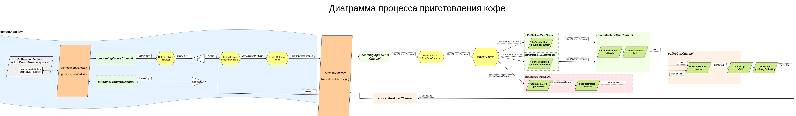

## Spring Integration: Процесс приготовления кофе

### Запуск

Используется Spring Batch, команда `coffee`:

````yaml
shell:>coffee

2023-06-07T13:39:39.254+07:00  INFO 379021 --- [   scheduling-1] r.o.s.c.service.StorageServiceImpl       : ===> To make Coffee the following items supplied:
 - Fresh water=1;
 - Coffee bean=1;
 - Milk=1
2023-06-07T13:39:39.257+07:00  INFO 379021 --- [   scheduling-1] r.o.s.c.service.KitchenServiceImpl       : ===> Order for cooking Coffee has been received by the kitchen having the following ingredients:
 - CoffeeBean();
 - FreshWater();
 - Milk()
2023-06-07T13:39:39.259+07:00  INFO 379021 --- [   scheduling-1] r.o.s.coffecooking.Named                 : ===> Coffee Machine: Filling with Fresh water...
2023-06-07T13:39:39.262+07:00  INFO 379021 --- [   scheduling-1] r.o.s.coffecooking.Named                 : ===> Coffee Machine: Filling with Coffee bean...
2023-06-07T13:39:39.263+07:00  INFO 379021 --- [   scheduling-1] r.o.s.coffecooking.Named                 : ===> Coffee Machine: Boiling water to make a cup of Black Coffee...
2023-06-07T13:39:39.263+07:00  INFO 379021 --- [   scheduling-1] r.o.s.coffecooking.Named                 : ===> Coffee Cup Supplier: New Coffee Cup supplied.
2023-06-07T13:39:39.263+07:00  INFO 379021 --- [   scheduling-1] r.o.s.coffecooking.Named                 : ===> Coffee Cup Supplier: Pouring Coffee into Coffee Cup...
2023-06-07T13:39:39.264+07:00  INFO 379021 --- [   scheduling-1] r.o.s.coffecooking.Named                 : ===> Cappuccinator: Filling with Milk...
2023-06-07T13:39:39.265+07:00  INFO 379021 --- [   scheduling-1] r.o.s.coffecooking.Named                 : ===> Cappuccinator: Frothing Milk...
2023-06-07T13:39:39.265+07:00  INFO 379021 --- [   scheduling-1] r.o.s.coffecooking.Named                 : ===> Coffee Cup Supplier: Pouring Frothed milk into Coffee Cup...
2023-06-07T13:39:39.266+07:00  INFO 379021 --- [   scheduling-1] r.o.s.coffecooking.Named                 : ===> Coffee Cup Supplier: Giving away Coffee Cup...
2023-06-07T13:39:39.267+07:00  INFO 379021 --- [onPool-worker-1] r.o.s.c.service.CoffeeshopServiceImpl    : ===> PRODUCT COOKED: Coffee Cup with content: Coffee and Frothed milk.
````

### Процедуры вызываются в следущем порядке:

1. Заказ поступает от прилавка магазина и передаётся на комплектацию ингридиентов. При этом заказ размещается
в заголовке "order" сообщения, а само сообщение будет содержать перечень предоставленных ингридиентов;
2. Заказ и ингридиенты поступают на кухню;
3. Ингридиенты закладываются в соответствующие агрегаты (параллельные процессы):
- вода и кофейные зёрна помещаются в кофемашину и когда все ингридиенты размещены, она запускается;
- молоко заливается в капучиннатор и он запускается;
4. По окончании работы кофемашины и капучиннатора автомат подачи кружек предоставляет очередную кружку и в неё
заливаются кофе и молоко;
5. Когда кружка полна, автомат её передает на выдачу из кухни;
6. Наполненная кружка передаётся на прилавок магазина.

### Диаграмма процесса выглядит следующим образом:



---
